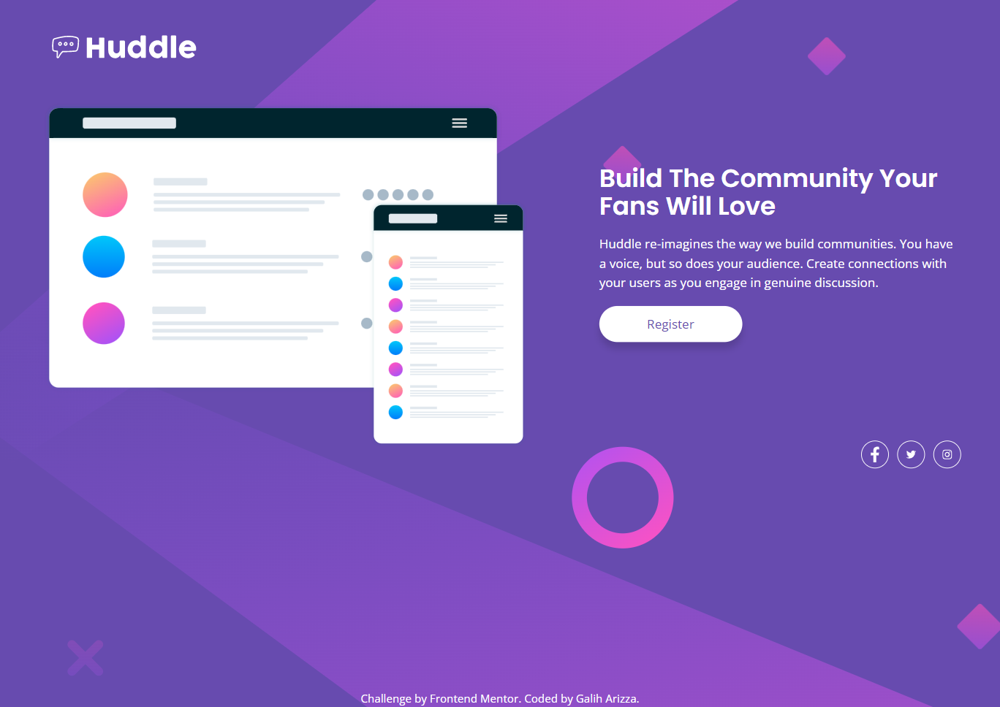

# Frontend Mentor - Huddle landing page with single introductory section solution

This is a solution to the [Huddle landing page with single introductory section challenge on Frontend Mentor](https://www.frontendmentor.io/challenges/huddle-landing-page-with-a-single-introductory-section-B_2Wvxgi0). Frontend Mentor challenges help you improve your coding skills by building realistic projects.

## Table of contents

- [Overview](#overview)
  - [The challenge](#the-challenge)
  - [Screenshot](#screenshot)
  - [Links](#links)
- [My process](#my-process)
  - [Built with](#built-with)
  - [What I learned](#what-i-learned)
  - [Continued development](#continued-development)
  - [Useful resources](#useful-resources)
- [Author](#author)
- [Acknowledgments](#acknowledgments)

## Overview

### The challenge

Users should be able to:

- View the optimal layout for the page depending on their device's screen size
- See hover states for all interactive elements on the page

### Screenshot

### Links

- Solution URL: [https://github.com/chadittya/huddle-landing-page-with-a-single-introductory-section](https://github.com/chadittya/huddle-landing-page-with-a-single-introductory-section)
- Live Site URL: [https://huddle-landing-page-with-a-single-introductory-section-lime-two.vercel.app/](https://huddle-landing-page-with-a-single-introductory-section-lime-two.vercel.app/)

## My process

### Built with

- Semantic HTML5 markup
- CSS custom properties
- Flexbox
- CSS Grid
- Mobile-first workflow
- [TypeScript](https://www.typescriptlang.org/) - Type safety JS language
- [Next.js](https://nextjs.org/) - React framework
- [Tailwind CSS](https://tailwindcss.com/) - For styles

### What I learned

1. TypeScript

- Statically-typed superset of JavaScript
- Optional type annotations
- Catch errors, better code completion and navigation tools
- Improves code maintainability and reduces runtime errors

2. Responsive Design

- Approach to web design that aims to create website that looks good on any device
- Uses techniques like fluid layouts, flexible images, and media queries
- Mobile-first design is a common strategy for creating responsive websites

3. Hover States

- Visual changes when user hovers over an interactive element on a webpage
- Provides feedback to the user and improves the user experience
- CSS pseudo-classes like `:hover` can be used to apply hover states to elements on a webpage.

Overall, I learned that TypeScript improves code quality, responsive design is essential for user-friendly websites, and hover states can enhance the user experience.

## Author

- Github - [chadittya](https://github.com/chadittya)
- Frontend Mentor - [@chadittya](https://www.frontendmentor.io/profile/chadittya)
- Twitter - [@galiharizza](https://www.twitter.com/galiharizza)
